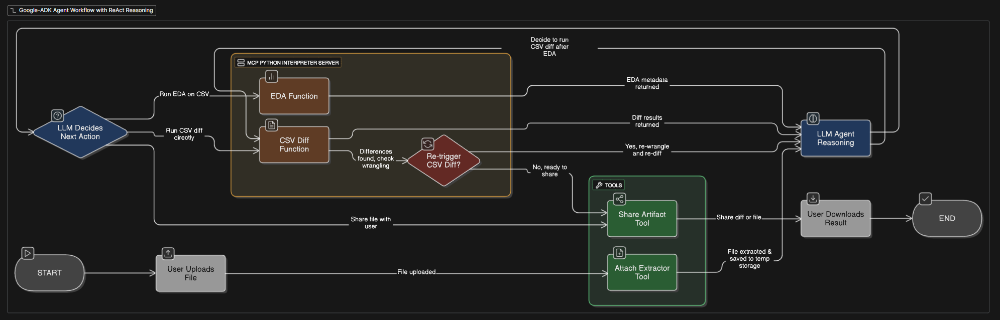

# CSV Diff Agent 📊

A Python-based agent built with Google ADK that helps users analyze and compare two CSV files to confirm data integrity and detect changes between file versions.

## Overview and architecture diagram

The CSV Diff Agent to streamline usage of [minimal-csv-diff](https://github.com/joon-solutions/minimal-csv-diff) utility.
The agent can perform comprehensive data validation by comparing two CSV files and identifying any discrepancies. It handles data format normalization, schema analysis, and provides detailed diff reports to ensure data consistency across file versions.

## Key Capabilities ✨

### File Processing & Analysis 📁
- **Automatic File Preview**: Reads and displays the first 5 lines of uploaded CSV files
- **Smart File Naming**: Suggests semantically meaningful names for uploaded files
- **Schema Analysis**: Performs Exploratory Data Analysis (EDA) to understand file structure and data types
- **Format Normalization**: Automatically standardizes column names and value formats between files

### Data Comparison 🔍
- **Intelligent Diffing**: Compares files at the string level after normalization
- **Composite Key Detection**: Identifies dimensional columns for reliable data anchoring
- **Metric Value Handling**: Distinguishes between dimensional and measure columns for accurate comparison
- **Discrepancy Detection**: Identifies data changes, additions, and deletions between file versions

### Output & Reporting 📋
- **Detailed Summary**: Provides step-by-step documentation of file conformance process
- **Reproducible Code**: Generates auditable Python code for manual reproduction
- **Artifact Sharing**: Delivers original files, conformed files, and diff results
- **UUID-based Naming**: Uses random UUIDs for output file organization

## Technical Features ⚙️

### Built with Google ADK
- Leverages Google Application Development Kit for robust agent functionality
- Utilizes multiple specialized tools for file operations and data processing

### Tool Integration 🔧
- **File I/O Operations**: Read, write, and rename files in temporary workspace
- **Python Code Execution**: Run ephemeral data processing scripts
- **Multi-file Analysis**: Parse and analyze multiple CSV files simultaneously
- **CSV Diffing**: Specialized tool for detecting data discrepancies

### Data Processing Pipeline 🔄
1. **File Upload & Validation**: Ensures exactly 2 CSV files are provided
2. **Preview & Naming**: Shows file content and handles renaming
3. **Schema Analysis**: Performs EDA to understand data structure
4. **Format Conformance**: Normalizes data types and column formats
5. **Diff Generation**: Creates comprehensive comparison report
6. **Artifact Delivery**: Shares all processed files with user

## Use Cases 💼

- **Data Migration Validation**: Confirm data integrity after system migrations
- **ETL Pipeline Testing**: Validate data transformations in processing pipelines
- **Version Control for Data**: Track changes between different versions of datasets
- **Quality Assurance**: Ensure data consistency across different environments
- **Audit Compliance**: Generate reproducible evidence of data validation processes

## Workflow 🚀

The agent follows a structured workflow to ensure thorough data validation:

1. **Input Validation**: Verifies that exactly 2 CSV files are provided
2. **File Inspection**: Previews file contents and handles renaming
3. **Data Profiling**: Analyzes schema and data characteristics
4. **Normalization**: Standardizes formats to enable accurate comparison
5. **Comparison**: Performs detailed diff analysis using composite keys
6. **Reporting**: Generates summary with reproducible steps and code
7. **Delivery**: Shares all artifacts including original, processed, and diff files

## Technical Requirements 📋

- Python environment with Google ADK
- Temporary workspace access (/tmp directory)
- CSV file processing capabilities
- UUID generation for file naming

## Output Artifacts 📦

For each comparison session, the agent provides:
- Original input files (with meaningful names)
- Conformed/normalized files
- Detailed diff results
- Step-by-step conformance documentation
- Reproducible Python code for manual execution

This agent is ideal for data engineers, analysts, and QA professionals who need reliable, automated CSV comparison with detailed audit trails and reproducible results. ✅
